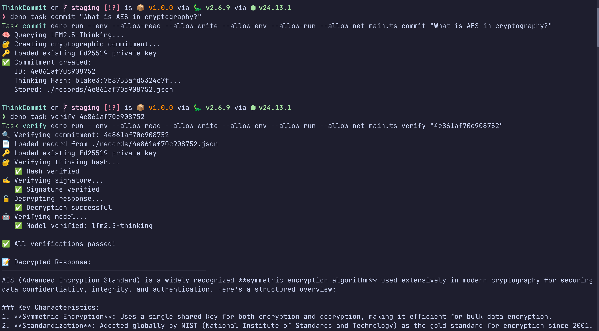
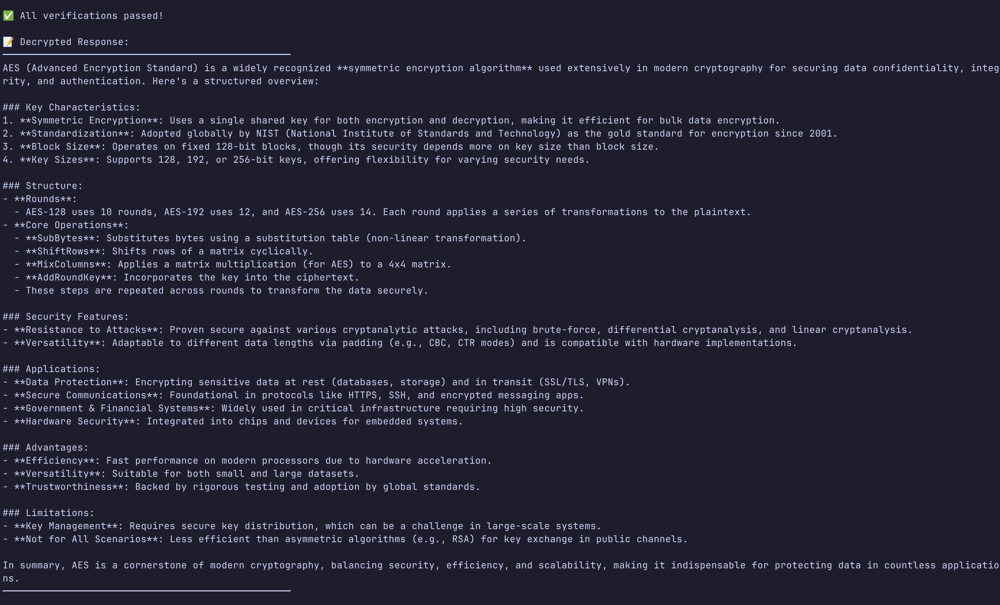
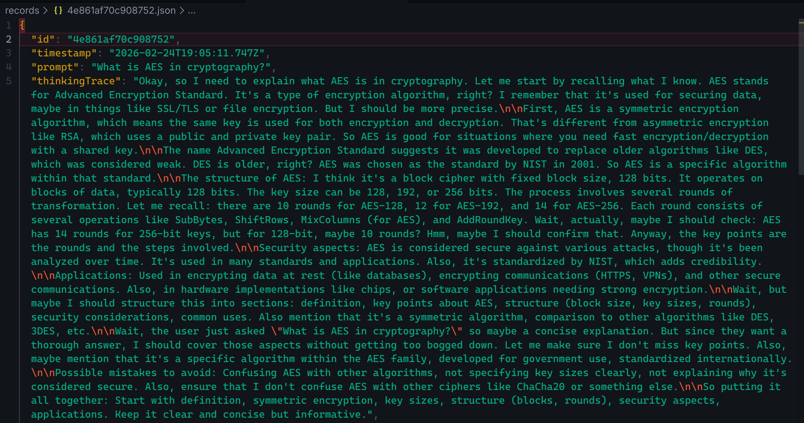

# 🧠 ThinkCommit

**Cryptographic Reasoning Commitment System**

ThinkCommit creates verifiable, tamper-proof records of AI reasoning by cryptographically committing to the AI's thinking trace BEFORE the answer is revealed. This is possible with the `lfm2.5-thinking` model because it outputs reasoning in a separate `thinking` field distinct from the `response` field.

```
┌─────────────┐     ┌─────────────┐     ┌─────────────┐
│   USER      │     │   DENO      │     │  LFM2.5     │
│             │     │             │     │  THINKING   │
└──────┬──────┘     └──────┬──────┘     └──────┬──────┘
       │                   │                   │
       │  1. Ask question  │                   │
       │──────────────────>│                   │
       │                   │                   │
       │                   │  2. Get thinking  │
       │                   │     + response    │
       │                   │──────────────────>│
       │                   │                   │
       │                   │  3. Return both   │
       │                   │<──────────────────│
       │                   │                   │
       │                   │  4. Hash thinking │
       │                   │     (BLAKE3)      │
       │                   │                   │
       │                   │  5. Sign hash     │
       │                   │     (Ed25519)     │
       │                   │                   │
       │                   │  6. Encrypt       │
       │                   │     response      │
       │                   │     (AES-GCM)     │
       │                   │                   │
       │                   │  7. Store record  │
       │                   │                   │
       │  8. Done!         │                   │
       │<──────────────────│                   │
```

## 📸 CLI Screenshots

### Creating a Commitment



*The CLI showing the commitment creation process with thinking hash generation and record storage.*

### Verifying a Commitment



*The CLI showing successful verification with hash, signature, and decryption checks all passing.*

### Example Record Structure



*A sample record file showing the complete JSON structure including the thinking trace, cryptographic hashes, signatures, and encrypted response. This demonstrates how the AI's reasoning is stored alongside its cryptographic commitment.*

## 📋 Table of Contents

- [Features](#-features)
- [What Problem Does This Solve?](#-what-problem-does-this-solve)
- [How It Works: Step by Step](#-how-it-works-step-by-step)
- [Prerequisites](#-prerequisites)
- [Quick Start (Local Execution)](#-quick-start-local-execution)
- [Docker Deployment](#-docker-deployment)
- [Manual Installation](#-manual-installation)
- [Usage](#-usage)
- [Record Format](#-record-format)
- [Cryptographic Details](#-cryptographic-details)
- [Security Properties](#-security-properties)
- [Why lfm2.5-thinking?](#-why-lfm25-thinking)
- [Architecture](#-architecture)
- [File Structure](#-file-structure)
- [Configuration Reference](#-configuration-reference)
- [Troubleshooting](#-troubleshooting)
- [Use Cases](#-use-cases)
- [Limitations](#-limitations)
- [Contributing](#-contributing)
- [License](#-license)

---

## ✨ Features

- **Cryptographic Commitment**: Hash the AI's reasoning with BLAKE3 before seeing the answer
- **Digital Signatures**: Sign commitments with Ed25519 for authenticity and non-repudiation
- **Encrypted Responses**: AES-256-GCM encryption keeps answers private until verification
- **Tamper-Evident**: Any modification to the thinking trace invalidates the hash
- **Deterministic Verification**: Same input always produces verifiable output
- **Docker Support**: Fully containerized deployment options
- **Local-First**: Everything runs locally; no data leaves your machine
- **Audit Trail**: Complete cryptographic proof of AI reasoning integrity

---

## 🤔 What Problem Does This Solve?

### The Trust Problem in AI Responses

When an AI provides an answer, you typically see only the **final response**. You have no way to verify:

1. **What reasoning led to this conclusion?**
2. **Was the reasoning tampered with after the fact?**
3. **Can I prove this answer came from this specific reasoning?**
4. **Was this answer generated before or after certain events?**

ThinkCommit solves this by creating a **cryptographic commitment** to the AI's thinking trace at the moment of generation, providing:

- **Temporal Proof**: The thinking was committed at a specific timestamp
- **Integrity Verification**: The thinking hasn't been modified since commitment
- **Authenticity**: The commitment was signed by a specific private key
- **Confidentiality**: The response remains encrypted until you choose to verify

### Real-World Scenarios

| Scenario | Problem | ThinkCommit Solution |
|----------|---------|---------------------|
| **Legal Discovery** | Need to prove AI analysis wasn't altered | Cryptographic hash proves integrity |
| **Academic Research** | Verify AI reasoning wasn't cherry-picked | Full thinking trace is committed |
| **Compliance Audits** | Prove decisions were made before regulations changed | Timestamped commitments |
| **Security Analysis** | Verify threat assessments weren't modified | Signed, tamper-evident records |
| **Medical Diagnosis** | Prove AI reasoning matched symptoms at time of consultation | Immutable reasoning record |

---

## 🔬 How It Works: Step by Step

### Phase 1: Commitment Creation

```
┌─────────────────────────────────────────────────────────────────┐
│                    COMMITMENT CREATION                          │
├─────────────────────────────────────────────────────────────────┤
│                                                                 │
│  Step 1: User submits question                                  │
│  ┌─────────────────────────────────────────────────────────┐   │
│  │ "Should I revoke PGP key ABC123?"                       │   │
│  └─────────────────────────────────────────────────────────┘   │
│                          │                                      │
│                          ▼                                      │
│  Step 2: Query LFM2.5-Thinking model                            │
│  ┌─────────────────────────────────────────────────────────┐   │
│  │ Model returns TWO separate outputs:                     │   │
│  │                                                         │   │
│  │ thinking: "The key ABC123 appears in leaked database..."│   │
│  │ response: "Yes, revoke immediately..."                  │   │
│  └─────────────────────────────────────────────────────────┘   │
│                          │                                      │
│                          ▼                                      │
│  Step 3: Hash the thinking trace (BLAKE3)                       │
│  ┌─────────────────────────────────────────────────────────┐   │
│  │ Input:  "The key ABC123 appears in leaked database..."  │   │
│  │ Output: blake3:7x9k2m4n5p6q... (32 bytes)               │   │
│  └─────────────────────────────────────────────────────────┘   │
│                          │                                      │
│                          ▼                                      │
│  Step 4: Sign hash + timestamp (Ed25519)                        │
│  ┌─────────────────────────────────────────────────────────┐   │
│  │ Content: "blake3:7x9k2m4n5p6q...:2026-01-20T14:30:00Z" │   │
│  │ Signature: ed25519:abc123... (64 bytes)                 │   │
│  └─────────────────────────────────────────────────────────┘   │
│                          │                                      │
│                          ▼                                      │
│  Step 5: Encrypt response (AES-256-GCM)                         │
│  ┌─────────────────────────────────────────────────────────┐   │
│  │ Key: Derived from private key via BLAKE3                │   │
│  │ Input:  "Yes, revoke immediately..."                    │   │
│  │ Output: aes256gcm:def456... + nonce                     │   │
│  └─────────────────────────────────────────────────────────┘   │
│                          │                                      │
│                          ▼                                      │
│  Step 6: Store complete record                                  │
│  ┌─────────────────────────────────────────────────────────┐   │
│  │ ./records/<id>.json (full record)                       │   │
│  │ ./records/<id>.public.json (public verification data)   │   │
│  └─────────────────────────────────────────────────────────┘   │
│                                                                 │
└─────────────────────────────────────────────────────────────────┘
```

### Phase 2: Verification (Any Time Later)

```
┌─────────────────────────────────────────────────────────────────┐
│                      VERIFICATION                               │
├─────────────────────────────────────────────────────────────────┤
│                                                                 │
│  Step 1: Load record from disk                                  │
│  ┌─────────────────────────────────────────────────────────┐   │
│  │ Read: ./records/<id>.json                               │   │
│  │ Extract: thinkingTrace, thinkingHash, signature, etc.   │   │
│  └─────────────────────────────────────────────────────────┘   │
│                          │                                      │
│                          ▼                                      │
│  Step 2: Re-hash thinking trace                                 │
│  ┌─────────────────────────────────────────────────────────┐   │
│  │ Compute: BLAKE3(thinkingTrace)                          │   │
│  │ Compare: Computed hash == Stored hash                   │   │
│  │ Result: ✅ MATCH or ❌ TAMPERED                         │   │
│  └─────────────────────────────────────────────────────────┘   │
│                          │                                      │
│                          ▼                                      │
│  Step 3: Verify signature                                       │
│  ┌─────────────────────────────────────────────────────────┐   │
│  │ Content: hash + timestamp                               │   │
│  │ Signature: ed25519 signature from record                │   │
│  │ Public Key: From record or derived from private key     │   │
│  │ Result: ✅ AUTHENTIC or ❌ FORGED                       │   │
│  └─────────────────────────────────────────────────────────┘   │
│                          │                                      │
│                          ▼                                      │
│  Step 4: Decrypt response                                       │
│  ┌─────────────────────────────────────────────────────────┐   │
│  │ Key: Derived from private key                           │   │
│  │ Ciphertext: From record                                 │   │
│  │ Nonce: From record                                      │   │
│  │ Result: Decrypted response revealed                     │   │
│  └─────────────────────────────────────────────────────────┘   │
│                          │                                      │
│                          ▼                                      │
│  Step 5: Report verification status                             │
│  ┌─────────────────────────────────────────────────────────┐   │
│  │ ✅ All verifications passed!                            │   │
│  │ 📝 Decrypted Response: [answer displayed]               │   │
│  └─────────────────────────────────────────────────────────┘   │
│                                                                 │
└─────────────────────────────────────────────────────────────────┘
```

---

## 🛠️ Prerequisites

### System Requirements

| Component | Minimum | Recommended |
|-----------|---------|-------------|
| **CPU** | 2 cores | 4+ cores |
| **RAM** | 4 GB | 8+ GB |
| **Storage** | 2 GB free | 10+ GB free |
| **OS** | Linux, macOS, Windows (WSL2) | Linux (native) |

### For Local Execution (Recommended)

- **Deno** >= 2.0 runtime
  - Modern TypeScript/JavaScript runtime
  - Secure by default with permission system
  - Built-in package management
  
- **Ollama** with `lfm2.5-thinking` model
  - Local LLM inference engine
  - Model size: ~1 GB
  - API endpoint: `http://localhost:11434`

### For Docker Deployment

- **Docker** >= 20.10
  - Container runtime for isolation
  - Consistent environment across systems
  
- **Docker Compose** >= 2.0
  - Multi-container orchestration
  - Simplified service management
  
- **NVIDIA GPU** (optional)
  - CUDA drivers for GPU acceleration
  - Significantly faster inference times

---

## 🚀 Quick Start (Local Execution)

### 1. Install Dependencies

```bash
# Install Deno (Linux/macOS)
curl -fsSL https://deno.land/install.sh | sh

# Install Ollama (Linux/macOS)
curl -fsSL https://ollama.ai/install.sh | sh

# Pull the thinking model (~1 GB)
ollama pull lfm2.5-thinking

# Verify installation
ollama list  # Should show lfm2.5-thinking
deno --version  # Should show version 2.0+
```

### 2. Clone and Configure

```bash
# Navigate to project
cd ThinkCommit

# Copy environment template
cp .env.example .env

# Edit if needed (defaults work for local Ollama)
nano .env
```

### 3. Create Your First Commitment

```bash
# Create a commitment
deno task commit "What is the security implication of using MD5 hashes?"

# Expected output:
# 🧠 Querying LFM2.5-Thinking...
# 🔐 Creating cryptographic commitment...
# ✅ Commitment created:
#    ID: <unique-id>
#    Thinking Hash: blake3:<hash>...
#    Stored: ./records/<id>.json
```

### 4. Verify the Commitment

```bash
# Use the ID from the previous step
deno task verify <unique-id>

# Expected output:
# 🔍 Verifying commitment: <id>
# 🔐 Verifying thinking hash... ✅
# ✍️  Verifying signature... ✅
# 🔓 Decrypting response... ✅
# ✅ All verifications passed!
```

---

## 🐳 Docker Deployment

### Architecture Overview

```
┌─────────────────────────────────────────────────────────────┐
│                     HOST SYSTEM                             │
│  ┌───────────────────────────────────────────────────────┐  │
│  │              Docker Container                         │  │
│  │  ┌─────────────────────────────────────────────────┐  │  │
│  │  │           ThinkCommit Deno App                  │  │  │
│  │  │  - main.ts (CLI)                                │  │  │
│  │  │  - commit.ts (Creation)                         │  │  │
│  │  │  - verify.ts (Verification)                     │  │  │
│  │  │  - crypto/* (Cryptography)                      │  │  │
│  │  │                                                 │  │  │
│  │  │  Volume Mounts:                                 │  │  │
│  │  │  ./keys:/app/keys                               │  │  │
│  │  │  ./records:/app/records                         │  │  │
│  │  └─────────────────────────────────────────────────┘  │  │
│  └───────────────────────────────────────────────────────┘  │
│                           │                                 │
│                           │ Network: localhost:11434        │
│                           ▼                                 │
│  ┌───────────────────────────────────────────────────────┐  │
│  │           Ollama (distrobox/native)                   │  │
│  │           lfm2.5-thinking model                       │  │
│  └───────────────────────────────────────────────────────┘  │
└─────────────────────────────────────────────────────────────┘
```

### Setup Steps

```bash
# 1. Ensure Ollama is running on host
ollama serve

# 2. Build and run
docker compose build
docker compose run --rm deno-app deno task commit "Your question"

# 3. Verify
docker compose run --rm deno-app deno task verify <record-id>
```

### Environment Configuration for Docker

```bash
# .env file for Docker
OLLAMA_HOST=http://host.docker.internal:11434  # Linux
# OLLAMA_HOST=http://docker.for.mac.localhost:11434  # macOS
# OLLAMA_HOST=http://docker.for.windows.localhost:11434  # Windows
```

---

## 💻 Manual Installation

### Detailed Installation Guide

#### Step 1: Install Ollama

**Linux:**
```bash
curl -fsSL https://ollama.ai/install.sh | sh
sudo systemctl start ollama
sudo systemctl enable ollama
```

**macOS:**
```bash
brew install ollama
ollama serve
```

**Windows (WSL2):**
```bash
# Install WSL2 first, then run Linux instructions inside WSL
wsl --install
# Then follow Linux instructions
```

#### Step 2: Download Model

```bash
# This downloads ~1 GB
ollama pull lfm2.5-thinking

# Verify download
ollama list

# Expected output:
# NAME                 ID           SIZE      MODIFIED
# lfm2.5-thinking      abc123...    1.0 GB    Now
```

#### Step 3: Install Deno

**Linux/macOS:**
```bash
curl -fsSL https://deno.land/install.sh | sh

# Add to PATH (follow installer instructions)
export DENO_INSTALL="$HOME/.deno"
export PATH="$DENO_INSTALL/bin:$PATH"

# Verify
deno --version
```

**Windows:**
```powershell
winget install Deno.Deno
# or
choco install deno
```

#### Step 4: Clone ThinkCommit

```bash
git clone <repository-url> ThinkCommit
cd ThinkCommit
```

---

## 📖 Usage

### Command Reference

#### `deno task commit [prompt]`

Creates a new cryptographic commitment.

```bash
# With inline prompt
deno task commit "What are the risks of quantum computing for RSA encryption?"

# Interactive mode (no prompt = asks for input)
deno task commit
# 📝 Enter your question (or press Ctrl+C to cancel):
# [type your question here]

# With environment override
OLLAMA_TEMPERATURE=0.5 deno task commit "Creative writing prompt..."
```

**Output Fields:**
- `ID`: 16-character hex identifier (first 16 chars of BLAKE3 hash)
- `Thinking Hash`: Full BLAKE3 hash of the thinking trace
- `Stored`: Path to the saved record file

#### `deno task verify <id>`

Verifies an existing commitment and decrypts the response.

```bash
# Verify by ID
deno task verify a3f8c2d1e9b4

# Verify with custom paths
KEYS_DIR=/backup/keys RECORDS_DIR=/backup/records deno task verify a3f8c2d1e9b4
```

**Verification Checks:**
1. **Hash Verification**: Re-computes BLAKE3(thinkingTrace) and compares to stored hash
2. **Signature Verification**: Verifies Ed25519 signature on hash:timestamp
3. **Decryption**: Decrypts response using derived AES key
4. **Model Verification**: Confirms model hash matches expected

#### `deno task start`

Runs the CLI in interactive mode (shows help if no arguments).

```bash
deno task start
# Shows help menu with all commands
```

### Environment Variables

| Variable | Default | Description | Valid Values |
|----------|---------|-------------|--------------|
| `OLLAMA_HOST` | `http://localhost:11434` | Ollama API endpoint URL | Any valid HTTP URL |
| `OLLAMA_MODEL` | `lfm2.5-thinking` | Model identifier | Must support `thinking` field |
| `OLLAMA_TEMPERATURE` | `0.1` | Sampling temperature | 0.0 (deterministic) to 1.0 (creative) |
| `KEYS_DIR` | `./keys` | Directory for private key | Any writable path |
| `RECORDS_DIR` | `./records` | Directory for records | Any writable path |

### Advanced Usage Examples

```bash
# Create commitment with custom temperature
OLLAMA_TEMPERATURE=0.3 deno task commit "Analyze this code..."

# Use custom key storage
KEYS_DIR=/secure/keys deno task commit "Sensitive question..."

# Verify from backup
RECORDS_DIR=/backup/records deno task verify abc123

# Full path specification
OLLAMA_HOST=http://192.168.1.100:11434 \
KEYS_DIR=/home/user/.thinkcommit/keys \
RECORDS_DIR=/home/user/.thinkcommit/records \
deno task commit "Question..."
```

---

## 📊 Record Format

### Full Record Structure (`<id>.json`)

```json
{
  "id": "a3f8c2d1e9b4",
  "timestamp": "2026-01-20T14:30:00.000Z",
  "prompt": "User's original question string",
  "thinkingTrace": "Complete AI reasoning process as generated by the model. This includes all intermediate thoughts, logical steps, considerations, and analytical pathways that led to the final response. The thinking trace may be several paragraphs long and contains the raw, unfiltered reasoning.",
  "thinkingHash": "blake3:7x9k2m4n5p6q8r9s0t1u2v3w4x5y6z7a8b9c0d1e2f3g4h5i6j7k8l9m0n1o2p3",
  "thinkingSignature": "ed25519:abc123def456...",
  "encryptedResponse": "aes256gcm:def456abc789...",
  "responseNonce": "1234567890abcdef12345678",
  "model": "lfm2.5-thinking",
  "modelHash": "blake3:modelhash123456789...",
  "publicKey": "ed25519pub:pubkey123456789..."
}
```

### Field Descriptions

| Field | Type | Description | Size |
|-------|------|-------------|------|
| `id` | string | Unique record identifier (16 hex chars) | 16 chars |
| `timestamp` | string | ISO 8601 UTC timestamp | Variable |
| `prompt` | string | Original user question | Variable |
| `thinkingTrace` | string | Complete AI reasoning | Variable (KB-MB) |
| `thinkingHash` | string | BLAKE3 hash with prefix | 71 chars |
| `thinkingSignature` | string | Ed25519 signature with prefix | 136 chars |
| `encryptedResponse` | string | AES-256-GCM ciphertext with prefix | Variable |
| `responseNonce` | string | 12-byte nonce as hex | 24 chars |
| `model` | string | Model identifier | Variable |
| `modelHash` | string | BLAKE3 hash of model name | 71 chars |
| `publicKey` | string | Ed25519 public key | Variable |

### Public Record Structure (`<id>.public.json`)

```json
{
  "id": "a3f8c2d1e9b4",
  "timestamp": "2026-01-20T14:30:00.000Z",
  "thinkingHash": "blake3:7x9k2m4n5p6q...",
  "thinkingSignature": "ed25519:abc123...",
  "model": "lfm2.5-thinking",
  "modelHash": "blake3:ghi012...",
  "publicKey": "pubkey345..."
}
```

**What's Excluded from Public Record:**
- ❌ `prompt` - User's question (privacy)
- ❌ `thinkingTrace` - Full reasoning (may contain sensitive analysis)
- ❌ `encryptedResponse` - Encrypted answer (confidential)
- ❌ `responseNonce` - Decryption nonce (confidential)

**What's Included:**
- ✅ Verification metadata only
- ✅ Can be shared publicly
- ✅ Allows third-party verification with public key

---

## 🔐 Cryptographic Details

### BLAKE3 Hashing

**Purpose**: Create a fixed-size fingerprint of the thinking trace.

```typescript
// Implementation from crypto/hash.ts
import { blake3 } from "@noble/hashes/blake3";

function hashThinking(thinking: string): Uint8Array {
  const encoder = new TextEncoder();
  const data = encoder.encode(thinking);
  return blake3(data, { dkLen: 32 });  // 32-byte (256-bit) output
}
```

**Properties:**
- **Output Size**: 32 bytes (256 bits)
- **Collision Resistance**: 2^128 operations to find collision
- **Speed**: ~3 GB/s on modern CPUs
- **Deterministic**: Same input always produces same output

**Why BLAKE3?**
- Faster than SHA-256 and SHA-3
- Secure and modern (2020 design)
- No known vulnerabilities
- Widely audited

### Ed25519 Digital Signatures

**Purpose**: Prove the commitment was created by the holder of the private key.

```typescript
// Implementation from crypto/sign.ts
import { ed25519 } from "@noble/curves/ed25519";

function signContent(content: string, privateKey: Uint8Array): Uint8Array {
  const encoder = new TextEncoder();
  const data = encoder.encode(content);
  return ed25519.sign(data, privateKey);  // 64-byte signature
}
```

**Properties:**
- **Key Size**: 32 bytes (256 bits)
- **Signature Size**: 64 bytes (512 bits)
- **Security**: 128-bit security level
- **Speed**: ~50,000 signatures/second

**Signed Content Format:**
```
<blake3_hash>:<iso_timestamp>
Example: 7x9k2m4n5p6q...:2026-01-20T14:30:00.000Z
```

**Why Ed25519?**
- Faster than RSA and ECDSA
- No known weaknesses
- Deterministic signatures (no randomness needed)
- Small key and signature sizes

### AES-256-GCM Encryption

**Purpose**: Keep the response confidential until verification time.

```typescript
// Implementation from crypto/encrypt.ts
async function encryptResponse(
  response: string,
  key: Uint8Array,
): Promise<{ ciphertext: Uint8Array; nonce: Uint8Array }> {
  const nonce = new Uint8Array(12);
  crypto.getRandomValues(nonce);
  
  const cryptoKey = await crypto.subtle.importKey(
    "raw", key, { name: "AES-GCM" }, false, ["encrypt"]
  );
  
  const ciphertext = await crypto.subtle.encrypt(
    { name: "AES-GCM", iv: nonce, tagLength: 128 },
    cryptoKey,
    new TextEncoder().encode(response)
  );
  
  return { ciphertext: new Uint8Array(ciphertext), nonce };
}
```

**Properties:**
- **Key Size**: 32 bytes (256 bits)
- **Nonce Size**: 12 bytes (96 bits)
- **Tag Size**: 16 bytes (128 bits authentication)
- **Security**: 256-bit security for confidentiality

**Key Derivation:**
```typescript
function deriveEncryptionKey(privateKey: Uint8Array): Uint8Array {
  const domainTag = new TextEncoder().encode("thinkcommit-encryption-key");
  const input = new Uint8Array(domainTag.length + privateKey.length);
  input.set(domainTag, 0);
  input.set(privateKey, domainTag.length);
  return blake3(input, { dkLen: 32 });
}
```

**Why AES-256-GCM?**
- Industry standard encryption
- Hardware accelerated on modern CPUs
- Authenticated encryption (detects tampering)
- No padding oracle vulnerabilities

---

## 🔒 Security Properties

### Detailed Security Analysis

| Property | Implementation | Guarantee |
|----------|----------------|-----------|
| **Commitment** | BLAKE3 hash of thinking trace | Thinking cannot be changed without detection |
| **Binding** | Hash committed before response revealed | Answer cannot influence committed thinking |
| **Authenticity** | Ed25519 signature on hash:timestamp | Proves who created the commitment |
| **Non-Repudiation** | Digital signature with private key | Creator cannot deny creating commitment |
| **Confidentiality** | AES-256-GCM encryption | Response hidden until verification |
| **Integrity** | GCM authentication tag | Tampering with ciphertext detected |
| **Temporal Proof** | ISO 8601 timestamp in signature | Proves when commitment was created |
| **Isolation** | Local execution, no network | No data exfiltration possible |

### Threat Model

#### What ThinkCommit Protects Against

| Threat | Protection | Mechanism |
|--------|------------|-----------|
| **Retroactive Modification** | ✅ Protected | BLAKE3 hash of thinking |
| **Thinking/Response Swapping** | ✅ Protected | Signature binds hash to timestamp |
| **Response Tampering** | ✅ Protected | AES-GCM authentication tag |
| **Identity Forgery** | ✅ Protected | Ed25519 signature verification |
| **Key Theft** | ⚠️ User Responsibility | Private key stored locally |
| **Network Interception** | ✅ Protected | Local-only execution |

#### What ThinkCommit Does NOT Protect Against

| Threat | Reason | Mitigation |
|--------|--------|------------|
| **Private Key Compromise** | Key stored on disk | Use encrypted storage, backups |
| **Model Compromise** | Trust in Ollama/model | Use verified model hashes |
| **System Compromise** | OS-level access | Secure your system |
| **Social Engineering** | Human factor | User education |
| **Timing Attacks** | Not in scope | Future enhancement |

### Key Security Guarantees

1. **Private Key Never Leaves `./keys/`**
   - Generated on first run
   - Stored as hex in `private_key.hex`
   - File permissions: 0600 (owner read/write only)
   - Used only for signing and key derivation

2. **Public Records Are Safe to Share**
   - `.public.json` contains no sensitive data
   - Cannot decrypt response without private key
   - Can be used for third-party verification

3. **Deterministic Output**
   - Temperature 0.1 for reproducibility
   - Same prompt + model = same output
   - Enables reliable verification

4. **Audited Cryptography**
   - @noble packages used throughout
   - Widely reviewed by security community
   - No known vulnerabilities

5. **Network Isolation**
   - Deno permissions restrict network access
   - Docker network isolation (optional)
   - All processing happens locally

---

## 🤔 Why lfm2.5-thinking?

### The Critical Innovation: Separate Thinking Field

Standard LLMs produce a **single output stream** that mixes reasoning with the final answer:

```
┌─────────────────────────────────────────────────────────┐
│ Standard LLM Output                                     │
├─────────────────────────────────────────────────────────┤
│                                                         │
│ "Let me think about this... [reasoning mixed in]...     │
│  so the answer is: [conclusion]"                        │
│                                                         │
│ Problem: Cannot separate reasoning from conclusion      │
│          Cannot commit to reasoning independently       │
└─────────────────────────────────────────────────────────┘
```

**lfm2.5-thinking** produces **two distinct outputs**:

```
┌─────────────────────────────────────────────────────────┐
│ lfm2.5-thinking Output                                  │
├─────────────────────────────────────────────────────────┤
│                                                         │
│ thinking: "The user is asking about X.                  │
│            Key considerations: A, B, C.                 │
│            Analysis shows... [complete reasoning]"      │
│                                                         │
│ response: "Based on the analysis, the answer is Y."     │
│                                                         │
│ Benefit: Can hash thinking BEFORE revealing response    │
└─────────────────────────────────────────────────────────┘
```

### Technical Comparison

| Feature | Standard LLMs | lfm2.5-thinking |
|---------|---------------|-----------------|
| **Output Structure** | Single text stream | Separate `thinking` + `response` fields |
| **Reasoning Access** | Mixed with answer | Isolated in `thinking` field |
| **Commitment Possible** | ❌ No | ✅ Yes |
| **Model Size** | Often 10+ GB | <1 GB |
| **Local Execution** | Sometimes | ✅ Yes |
| **API Required** | Often cloud-based | ✅ Fully local |

### Why This Matters

The separate `thinking` field enables the **commitment scheme**:

1. **Receive** both `thinking` and `response` from model
2. **Hash** the `thinking` field immediately
3. **Sign** the hash with timestamp
4. **Encrypt** the `response` field
5. **Store** everything together

This creates **cryptographic proof** that the thinking was committed before the response was revealed.

### Model Specifications

#### Core Specifications

| Specification | Value |
|---------------|-------|
| **Parameter Count** | 1.2 billion (1.2B) |
| **Memory Footprint** | 720 MB – 1.6 GB (depending on quantization) |
| **Context Window** | 32,768 tokens (32K) |
| **Model Type** | Reasoning model with thinking traces |
| **License** | Open-weight (unrestricted use, fine-tuning, deployment) |
| **Developer** | Liquid AI |
| **Release Date** | January 2026 |

#### Architecture & Training

The model follows a multi-stage training pipeline:

| Stage | Description |
|-------|-------------|
| **Midtraining** | Includes reasoning traces to internalize "reason first, then answer" pattern |
| **SFT** (Supervised Fine-Tuning) | Synthetic reasoning traces for reliable chain-of-thought generation |
| **DPO** (Direct Preference Optimization) | Preference alignment to reduce doom looping |
| **RLVR** (Reinforcement Learning with Verifiable Rewards) | Final stage with repetition penalty to eliminate looping |

**Doom Loop Mitigation:** The training process specifically addresses "doom looping" (getting stuck in repetitive patterns), reducing it from 15.74% to 0.36% through DPO and RLVR techniques.

#### Thinking Field Format

```
┌─────────────────────────────────────────────────────────┐
│ Ollama API Response Structure                           │
├─────────────────────────────────────────────────────────┤
│ {                                                       │
│   "thinking": "The user is asking about X...           │
│ │               [complete reasoning trace]...",         │
│   "response": "Based on the analysis, the answer...",   │
│   "model": "lfm2.5-thinking",                           │
│   "done": true                                          │
│ }                                                       │
└─────────────────────────────────────────────────────────┘
```

**Thinking Mechanism:**
- Model generates thinking traces **before** producing answers
- Works through problems systematically
- Pattern: **"reason first, then answer"**
- No specific format reward needed – SFT on synthetic traces enables reliable chain-of-thought generation

#### Performance Benchmarks

| Benchmark | LFM2.5-1.2B-Thinking | Qwen3-1.7B (thinking) |
|-----------|---------------------|----------------------|
| **GPQA Diamond** | 37.86 | 36.93 |
| **MMLU-Pro** | 49.65 | 56.68 |
| **IFEval** | 88.42 | 71.65 |
| **GSM8K** | 85.60 | 85.60 |
| **MATH-500** | 87.96 | 81.92 |
| **AIME25** | 31.73 | 36.27 |
| **BFCLv3** (Tool Use) | 56.97 | 55.41 |

**Key Improvements Over Non-Thinking Version:**
- Math Reasoning (MATH-500): 63 → **88**
- Instruction Following (Multi-IF): 61 → **69**
- Tool Use (BFCLv3): 49 → **57**

#### Inference Speed (Sample Devices)

| Device | Hardware | Decode (tok/s) | Memory |
|--------|----------|----------------|--------|
| Snapdragon 8 Elite | NPU | 82 | 0.9 GB |
| Samsung Galaxy S25 Ultra | CPU | 70 | 720 MB |
| Apple M4 Pro | CPU (INT8) | 96 | 722 MB |
| AMD Ryzen AI Max 395+ | CPU | 235 | 853 MB |

**Long-Context Performance** (AMD Ryzen NPU):
- 16K context: ~52 tok/s decode throughput
- 32K context: ~46 tok/s decode throughput

#### System Requirements

| Requirement | Minimum | Recommended |
|-------------|---------|-------------|
| **RAM** | 4 GB | 8 GB |
| **Storage** | 2 GB free | 10 GB free |
| **CPU** | x86 with AVX2 or ARM | Modern multi-core |
| **NPU** (optional) | Snapdragon X Elite, AMD Ryzen AI | For accelerated inference |

#### Supported Frameworks

- Ollama
- llama.cpp (GGUF format)
- MLX (Apple Silicon)
- vLLM
- ONNX Runtime
- LM Studio
- FastFlowLM
- NexaML

#### What Makes This Model Unique

1. **On-device reasoning under 1GB** – Runs entirely offline on phones
2. **40% fewer parameters than competitors** yet matches or exceeds performance
3. **Efficient test-time compute** – Fewer output tokens for higher performance
4. **Doom loop elimination** – Reduced from 15.74% to 0.36%
5. **Long-context scalability** – Maintains throughput at 32K context
6. **Open-weight with no restrictions** – Full family available across all formats

#### Recommended Usage

| Use LFM2.5-1.2B-Thinking For | Use Standard Instruct For |
|------------------------------|--------------------------|
| Math reasoning | Chat capabilities |
| Tool use / Agent tasks | Creative writing |
| Programming | General conversation |
| Instruction following | |
| Planning & verification tasks | |

**Optimal Settings:**
- Temperature: 0.05–0.2 (lower = more deterministic)
- Think: true (enable thinking field output)
- Repetition penalty: ~1.05 (light)

---

## 🏗️ Architecture

### System Architecture Diagram

```
┌─────────────────────────────────────────────────────────────────────┐
│                         ThinkCommit System                          │
├─────────────────────────────────────────────────────────────────────┤
│                                                                     │
│  ┌──────────────┐                                                   │
│  │    USER      │                                                   │
│  │  (Question)  │                                                   │
│  └──────┬───────┘                                                   │
│         │                                                           │
│         ▼                                                           │
│  ┌──────────────────────────────────────────────────────────────┐  │
│  │                    CLI (main.ts)                             │  │
│  │  - Parse arguments                                           │  │
│  │  - Route to commit/verify                                    │  │
│  │  - Display results                                           │  │
│  └──────────────────────────────────────────────────────────────┘  │
│         │                                                           │
│         ├─────────────────────┬─────────────────────────────┐      │
│         ▼                     ▼                             ▼      │
│  ┌──────────────┐     ┌──────────────┐            ┌──────────────┐│
│  │  commit.ts   │     │  verify.ts   │            │  crypto/     ││
│  │              │     │              │            │              ││
│  │ - Query      │     │ - Load       │            │ - hash.ts    ││
│  │   Ollama     │     │   record     │            │ - sign.ts    ││
│  │ - Hash       │     │ - Verify     │            │ - encrypt.ts ││
│  │   thinking   │     │   hash       │            │              ││
│  │ - Sign       │     │ - Verify     │            │              ││
│  │ - Encrypt    │     │   signature  │            │              ││
│  │ - Store      │     │ - Decrypt    │            │              ││
│  └──────────────┘     └──────────────┘            └──────────────┘│
│         │                     │                             │      │
│         │                     │                             │      │
│         ▼                     ▼                             ▼      │
│  ┌──────────────────────────────────────────────────────────────┐  │
│  │                    External Services                         │  │
│  │  ┌────────────────┐  ┌────────────────┐  ┌────────────────┐  │  │
│  │  │    Ollama      │  │   File System  │  │   Web Crypto   │  │  │
│  │  │  (HTTP API)    │  │   (records/)   │  │     API        │  │  │
│  │  │                │  │   (keys/)      │  │                │  │  │
│  │  └────────────────┘  └────────────────┘  └────────────────┘  │  │
│  └──────────────────────────────────────────────────────────────┘  │
│                                                                     │
└─────────────────────────────────────────────────────────────────────┘
```

### Component Responsibilities

| Component | File | Responsibility |
|-----------|------|----------------|
| **CLI Entry Point** | `main.ts` | Command parsing, argument handling, help display |
| **Commitment Creation** | `commit.ts` | Ollama API, hashing, signing, encryption, storage |
| **Verification** | `verify.ts` | Record loading, hash verification, signature verification, decryption |
| **Hashing** | `crypto/hash.ts` | BLAKE3 hash computation, hex conversion |
| **Signing** | `crypto/sign.ts` | Key generation, Ed25519 signing, signature verification |
| **Encryption** | `crypto/encrypt.ts` | Key derivation, AES-256-GCM encryption/decryption |

### Data Flow

```
Commitment Creation:
User Question → Ollama API → thinking + response
    ↓
thinking → BLAKE3 → hash → Ed25519 → signature
    ↓
response → AES-256-GCM → ciphertext + nonce
    ↓
{hash, signature, ciphertext, nonce, ...} → File System → record.json

Verification:
record.json → Parse → hash, signature, ciphertext
    ↓
thinkingTrace → BLAKE3 → computed_hash → Compare with stored hash
    ↓
hash:timestamp + signature + publicKey → Ed25519.verify() → boolean
    ↓
ciphertext + nonce + key → AES-256-GCM.decrypt() → response
    ↓
Display: Verification status + decrypted response
```

---

## 📁 File Structure

### Complete Project Layout

```
ThinkCommit/
├── 📄 README.md                 # This documentation file
├── 📄 USAGE.md                  # Quick usage reference
├── 📄 deno.json                 # Deno configuration and tasks
├── 📄 deno.lock                 # Dependency lock file (auto-generated)
├── 📄 Dockerfile                # Docker build instructions
├── 📄 docker-compose.yml        # Docker Compose configuration
├── 📄 .env                      # Environment variables (gitignored)
├── 📄 .env.example              # Environment template
├── 📄 .dockerignore             # Docker build exclusions
│
├── 📁 crypto/                   # Cryptographic modules
│   ├── 📄 hash.ts               # BLAKE3 hashing utilities
│   ├── 📄 sign.ts               # Ed25519 signing utilities
│   └── 📄 encrypt.ts            # AES-256-GCM encryption utilities
│
├── 📁 keys/                     # Private key storage (gitignored)
│   ├── 📄 .gitkeep              # Directory placeholder
│   └── 📄 private_key.hex       # Ed25519 private key (auto-generated)
│
├── 📁 records/                  # Commitment records (gitignored)
│   ├── 📄 .gitkeep              # Directory placeholder
│   ├── 📄 <id>.json             # Full record (private)
│   └── 📄 <id>.public.json      # Public record (shareable)
│
└── 📄 Source Files
    ├── 📄 main.ts               # CLI entry point
    ├── 📄 commit.ts             # Commitment creation logic
    └── 📄 verify.ts             # Verification logic
```

### File Size Estimates

| File/Directory | Typical Size | Notes |
|----------------|--------------|-------|
| `crypto/*.ts` | 3-5 KB each | Compact, focused modules |
| `main.ts` | ~4 KB | CLI parsing and routing |
| `commit.ts` | ~8 KB | Full commitment workflow |
| `verify.ts` | ~7 KB | Verification workflow |
| `keys/private_key.hex` | 64 bytes | Single Ed25519 key |
| `records/<id>.json` | 1-100 KB | Varies with thinking trace length |
| `records/<id>.public.json` | ~500 bytes | Fixed size metadata only |

---

## ⚙️ Configuration Reference

### deno.json Configuration

```json
{
  "name": "thinkcommit",
  "version": "1.0.0",
  "exports": "./main.ts",
  "tasks": {
    "commit": "deno run --env --allow-read --allow-write --allow-env --allow-run --allow-net main.ts commit",
    "verify": "deno run --env --allow-read --allow-write --allow-env --allow-run --allow-net main.ts verify",
    "start": "deno run --env --allow-read --allow-write --allow-env --allow-run --allow-net main.ts"
  },
  "imports": {
    "@noble/curves": "npm:@noble/curves@^1.0.0",
    "@noble/curves/ed25519": "npm:@noble/curves@^1.0.0/ed25519",
    "@noble/hashes": "npm:@noble/hashes@^1.0.0",
    "@noble/hashes/blake3": "npm:@noble/hashes@^1.0.0/blake3",
    "@noble/hashes/utils": "npm:@noble/hashes@^1.0.0/utils"
  }
}
```

### Permission Explanation

| Permission | Why Needed |
|------------|------------|
| `--allow-read` | Read records, keys, and .env file |
| `--allow-write` | Write new records and private key |
| `--allow-env` | Read environment variables |
| `--allow-run` | Spawn subprocesses (if needed) |
| `--allow-net` | Connect to Ollama API |

### Environment Variable Precedence

1. **Command-line override** (highest priority)
   ```bash
   OLLAMA_HOST=http://custom:11434 deno task commit "..."
   ```

2. **`.env` file** (medium priority)
   ```bash
   # .env
   OLLAMA_HOST=http://localhost:11434
   ```

3. **Default values in code** (lowest priority)
   ```typescript
   const OLLAMA_HOST = Deno.env.get("OLLAMA_HOST") ?? "http://localhost:11434";
   ```

---

## 🔧 Troubleshooting

### Common Issues and Solutions

#### "Failed to connect to Ollama"

**Error:**
```
❌ Error creating commitment: Failed to connect to Ollama at http://localhost:11434
```

**Solutions:**
```bash
# 1. Check if Ollama is running
ollama list

# 2. Start Ollama if not running
ollama serve

# 3. Verify model is installed
ollama pull lfm2.5-thinking

# 4. Test API directly
curl http://localhost:11434/api/tags

# 5. Check environment variable
echo $OLLAMA_HOST  # Should be http://localhost:11434
```

#### "Signature verification failed"

**Error:**
```
✍️  Verifying signature... ❌ Invalid signature
```

**Solutions:**
```bash
# 1. Ensure using same private key
ls -la ./keys/private_key.hex

# 2. Check record wasn't corrupted
cat ./records/<id>.json | jq .

# 3. Verify timestamp format is ISO 8601
cat ./records/<id>.json | jq .timestamp
```

#### "Hash mismatch"

**Error:**
```
🔐 Verifying thinking hash... ❌ Hash mismatch
```

**Causes:**
- Thinking trace was modified after commitment
- Record file was corrupted
- Different encoding (UTF-8 vs other)

**Solutions:**
```bash
# 1. Check file integrity
sha256sum ./records/<id>.json

# 2. Compare with backup if available

# 3. Verify no manual edits were made
```

#### "Permission denied"

**Error:**
```
error: Permission denied
```

**Solutions:**
```bash
# 1. Check file permissions
ls -la ./keys/
ls -la ./records/

# 2. Fix permissions if needed
chmod 700 ./keys/
chmod 600 ./keys/private_key.hex
chmod 700 ./records/

# 3. Ensure running with correct Deno permissions
deno task commit "..."  # Uses permissions from deno.json
```

#### "Model not found"

**Error:**
```
Ollama API error: model 'lfm2.5-thinking' not found
```

**Solutions:**
```bash
# 1. Pull the model
ollama pull lfm2.5-thinking

# 2. Verify installation
ollama list | grep lfm2.5-thinking

# 3. Check OLLAMA_MODEL environment variable
echo $OLLAMA_MODEL  # Should be lfm2.5-thinking
```

### Debug Mode

Enable verbose logging by modifying the code temporarily:

```typescript
// Add to main.ts or relevant files
console.debug("Debug info:", {
  ollamaHost: Deno.env.get("OLLAMA_HOST"),
  recordsDir: Deno.env.get("RECORDS_DIR"),
  keysDir: Deno.env.get("KEYS_DIR"),
});
```

---

## 💡 Use Cases

### Legal and Compliance

**Scenario:** Law firm needs to prove AI document analysis wasn't altered.

```bash
# Create commitment at time of analysis
deno task commit "Analyze this contract for liability clauses"

# Later, prove integrity in court
deno task verify <record-id>
# Produces cryptographic proof of unaltered analysis
```

**Benefits:**
- Tamper-evident record
- Timestamped proof
- Third-party verifiable

### Academic Research

**Scenario:** Researcher wants to prove AI reasoning wasn't cherry-picked.

```bash
# Commit all AI analyses during research
deno task commit "Evaluate this dataset for patterns"

# Include public records in paper supplement
cat records/<id>.public.json >> research_supplement.json
```

**Benefits:**
- Full reasoning transparency
- Prevents selection bias
- Reproducible methodology

### Security Analysis

**Scenario:** Security team needs immutable threat assessments.

```bash
# Create commitment for each threat assessment
deno task commit "Assess vulnerability CVE-2024-XXXX"

# Store in secure audit log
cp records/<id>.json /secure/audit/log/
```

**Benefits:**
- Immutable audit trail
- Proves assessment timing
- Encrypted sensitive findings

### Medical Decision Support

**Scenario:** Hospital needs to record AI diagnostic reasoning.

```bash
# Commit diagnostic reasoning
deno task commit "Patient symptoms: fever, cough, fatigue. Differential diagnosis?"

# Store in medical records system
# Verify later if treatment decisions are questioned
```

**Benefits:**
- Complete reasoning record
- Legal protection
- Quality assurance

### Financial Compliance

**Scenario:** Investment firm needs to document AI-driven decisions.

```bash
# Commit investment analysis
deno task commit "Analyze Q4 earnings for portfolio company XYZ"

# Provide to regulators on request
deno task verify <record-id>
```

**Benefits:**
- Regulatory compliance
- Decision audit trail
- Fiduciary protection

---

## ⚠️ Limitations

### Technical Limitations

| Limitation | Impact | Workaround |
|------------|--------|------------|
| **Model Dependency** | Only works with lfm2.5-thinking | Wait for other models with thinking field |
| **Local Execution** | Requires local Ollama | Use Docker or install locally |
| **Key Management** | Single private key | Implement key rotation (future) |
| **Storage** | Records accumulate over time | Implement archival/deletion policy |
| **Timestamp Trust** | Relies on system clock | Use NTP-synced systems |

### Security Limitations

| Limitation | Risk | Mitigation |
|------------|------|------------|
| **Private Key Storage** | Key theft compromises all records | Encrypt key, use secure storage |
| **Model Integrity** | Compromised model produces bad output | Verify model hash, use trusted source |
| **System Security** | OS compromise affects everything | Secure your system, use encryption |
| **No HSM Support** | Keys not in hardware security module | Future enhancement |

### Operational Limitations

| Limitation | Impact |
|------------|--------|
| **No Multi-User Support** | Single key for all commitments |
| **No Key Rotation** | Cannot change key without breaking old records |
| **No Remote Verification** | Must have access to record files |
| **No Batch Operations** | One commitment at a time |

---

## 🤝 Contributing

### How to Contribute

1. **Report Bugs**: Open an issue with detailed reproduction steps
2. **Feature Requests**: Describe the use case and expected behavior
3. **Code Contributions**: Submit pull requests with tests
4. **Documentation**: Improve docs, add examples, fix typos

### Development Setup

```bash
# Clone repository
git clone <repository-url>
cd ThinkCommit

# Install dependencies (Deno handles automatically)
deno cache main.ts

# Run tests (when available)
deno test

# Format code
deno fmt

# Lint code
deno lint
```

### Code Style

- **TypeScript**: Strict mode enabled
- **Formatting**: Deno formatter (2-space indent, 100 char line width)
- **Naming**: camelCase for variables, PascalCase for types/interfaces
- **Comments**: JSDoc for public functions, inline for complex logic

---

## 📄 License

MIT License

Copyright (c) 2024 ThinkCommit Contributors

Permission is hereby granted, free of charge, to any person obtaining a copy
of this software and associated documentation files (the "Software"), to deal
in the Software without restriction, including without limitation the rights
to use, copy, modify, merge, publish, distribute, sublicense, and/or sell
copies of the Software, and to permit persons to whom the Software is
furnished to do so, subject to the following conditions:

The above copyright notice and this permission notice shall be included in all
copies or substantial portions of the Software.

THE SOFTWARE IS PROVIDED "AS IS", WITHOUT WARRANTY OF ANY KIND, EXPRESS OR
IMPLIED, INCLUDING BUT NOT LIMITED TO THE WARRANTIES OF MERCHANTABILITY,
FITNESS FOR A PARTICULAR PURPOSE AND NONINFRINGEMENT. IN NO EVENT SHALL THE
AUTHORS OR COPYRIGHT HOLDERS BE LIABLE FOR ANY CLAIM, DAMAGES OR OTHER
LIABILITY, WHETHER IN AN ACTION OF CONTRACT, TORT OR OTHERWISE, ARISING FROM,
OUT OF OR IN CONNECTION WITH THE SOFTWARE OR THE USE OR OTHER DEALINGS IN THE
SOFTWARE.

---

## 📚 Additional Resources

### Cryptography References

- [BLAKE3 Specification](https://blake3.io/)
- [Ed25519 Paper](https://ed25519.cr.yp.to/)
- [AES-GCM NIST Standard](https://csrc.nist.gov/publications/detail/sp/800-38d/final)
- [@noble Libraries](https://github.com/paulmillr/noble-curves)

### Related Projects

- [Ollama](https://ollama.ai/) - Local LLM inference
- [Deno](https://deno.land/) - Secure TypeScript runtime
- [SIGIT](https://github.com/) - Similar commitment schemes

### Further Reading

- "Commitment Schemes" - Cryptography textbooks
- "Zero-Knowledge Proofs" - Advanced verification
- "Audit Trails" - Compliance documentation

---

## 🙏 Acknowledgments

- **@noble libraries** for secure, audited cryptographic primitives
- **Ollama** for enabling local LLM inference
- **Deno** for a secure, modern TypeScript runtime
- **LFM2.5-thinking model** creators for the innovative thinking field
